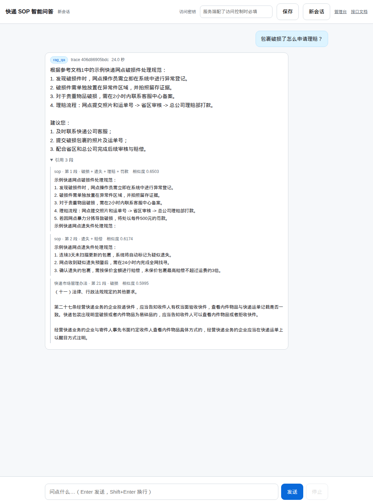
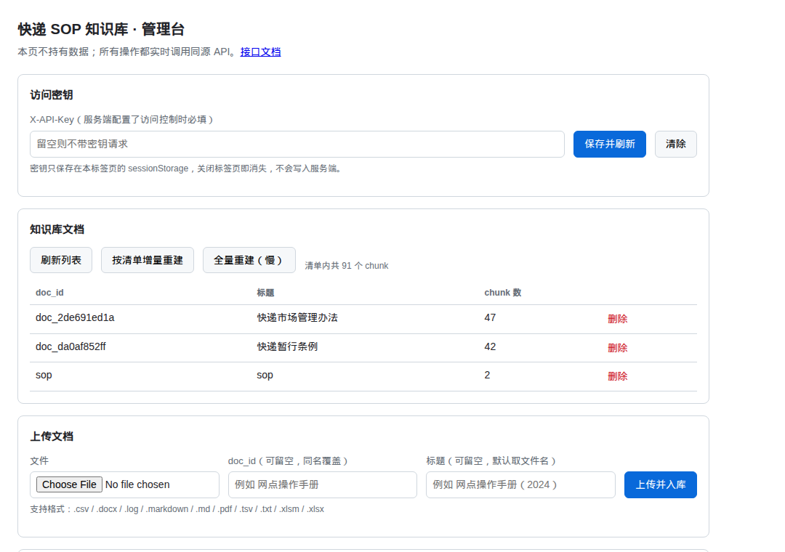
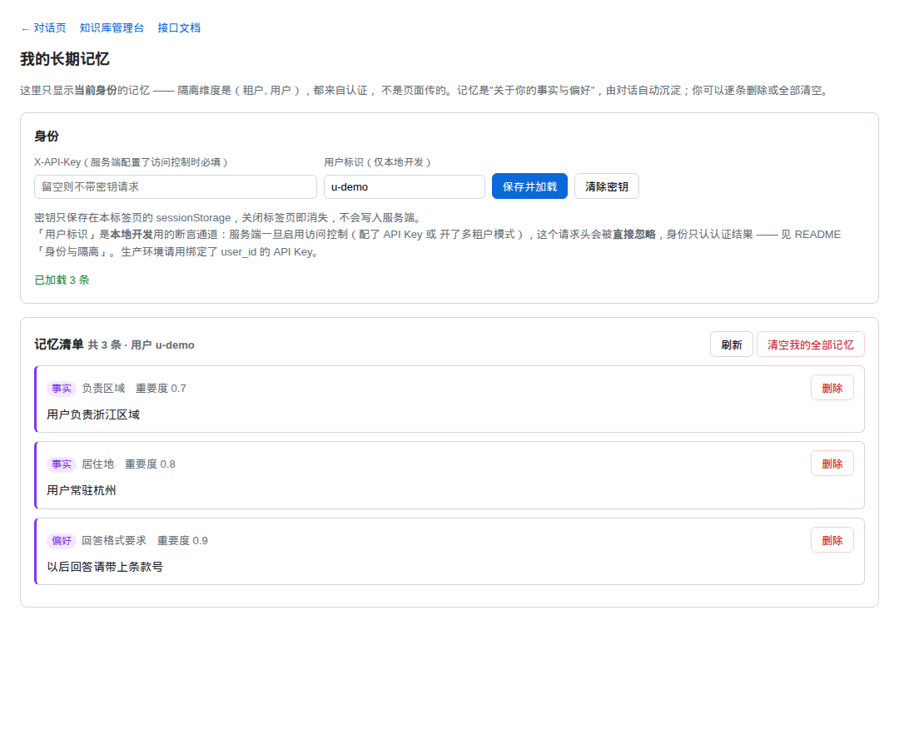
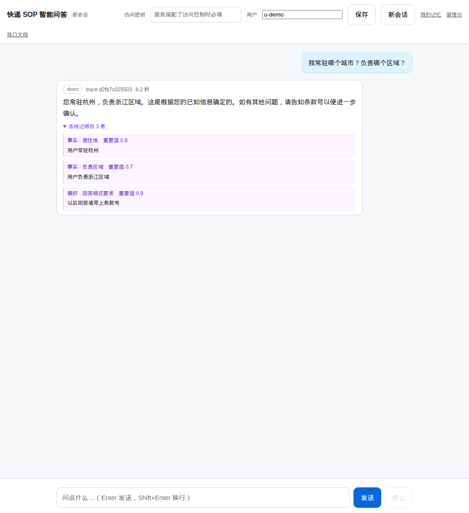

# 快递 SOP 智能问答系统

生产级架构的 FastAPI + LangGraph + RAG 项目：意图识别路由 → 知识库问答 / 直接回答 / 多轮检索，
面向有 Java/PHP 后端背景、转向 AI Agent 开发的读者。



> 上图是真实运行截图：`rag_qa` 意图、24.0 秒、trace id、以及展开的**引用来源**——
> 每条都带「文档 · 第 N 段 · 标签 · 相似度」，可以核对模型到底引用了原文哪一段。
> 打开 `/` 就是这个页面，`/admin` 是知识库管理台。

## 架构

```
                ┌────────────── FastAPI (app/main.py) ──────────────┐
                │        所有业务接口挂在 /api/v1 前缀下             │
                │  /health[/ready] /metrics /chat[/stream|/feedback]  │
                │  /rag/* /eval/*                                    │
                └───────────────┬────────────────────────────────────┘
              core/ 横切层: 结构化 JSON 日志 + trace_id │ 请求日志中间件
                          统一异常处理 │ X-API-Key 鉴权 (可选)
                                │
                     ┌──────────▼───────────┐
                     │  services/ 业务层     │  不碰 HTTP 细节
                     │  chat_service: 限流   │  (Semaphore) + 超时降级
                     │  (wait_for+fallback) │
                     └──────────┬───────────┘
                     ┌──────────▼───────────┐
                     │  agents/ LangGraph    │  意图识别 → 条件路由
                     │  (依赖注入装配)       │
                     └───┬───────┬──────┬───┘
              rag_qa ────┘       │      └──── multi_hop (检索→阈值判断→改写再检索)
              direct ────────────┘
                                │
                     ┌──────────▼───────────┐
                     │  services/rag_service │  ingest / retrieve / ask
                     └──────────┬───────────┘
        ┌───────────────────────┼────────────────────────┐
┌───────▼────────┐   ┌──────────▼──────────┐   ┌─────────▼─────────┐
│ infrastructure │   │  infrastructure     │   │  infrastructure   │
│ llm.py         │   │  embeddings.py      │   │  vector_store.py  │
│ LLMClient 协议 │   │  EmbeddingClient    │   │  VectorStore 协议 │
│ ChatOllama 实现│   │  Ollama 实现(bge-m3)│   │  Chroma 持久化实现│
└────────────────┘   └─────────────────────┘   └───────────────────┘
     全部走 Protocol 抽象 + 工厂注入: 换实现不改业务层
```

## 分层职责

| 目录 | 职责 |
|------|------|
| `app/main.py` | 应用工厂 `create_app()` + lifespan（启动时建/加载索引） |
| `app/config.py` | pydantic-settings 集中配置，环境变量前缀 `SOP_QA_`，仓库零密钥 |
| `app/core/` | 横切关注点：结构化日志+trace_id、统一异常、请求日志中间件、API Key 鉴权 |
| `app/schemas/` | Pydantic DTO，按资源分文件（chat/rag/eval/feedback/common） |
| `app/infrastructure/` | 外部系统适配层：LLM / Embedding / 向量库 / 文档解析，Protocol 抽象 + 工厂 |
| `app/services/` | 业务逻辑层：RAG 服务、问答编排（限流/超时降级）、检索评测 |
| `app/agents/` | LangGraph 编排：ChatState、节点工厂、图装配（依赖注入，无全局单例） |
| `app/api/` | HTTP 层：依赖注入 + 版本化路由 `/api/v1` |
| `scripts/run_eval.py` | 命令行评测入口（不启动 HTTP） |
| `data/` | `corpus/` 真实语料（法规/规范，每篇一个文档）· `sop.txt` 演示文档（自拟假数据，非任何公司真实制度）· `chroma/` Chroma 运行时产物（gitignore） |

## 接口清单（前缀 `/api/v1`）

| 方法 | 路径 | 功能 | 鉴权 |
|------|------|------|------|
| GET | `/api/v1/health` | **存活探针**（liveness）：进程能响应即 200，**不打网络、不探依赖** | 否 |
| GET | `/api/v1/health/ready` | **就绪探针**（readiness）：探 Ollama + 查索引，不可用返回 **503** + `reasons` | 否 |
| GET | `/api/v1/metrics` | Prometheus 指标（HTTP/chat/缓存/评测等，见 `app/core/metrics.py`） | 否 |
| POST | `/api/v1/chat` | 智能问答主接口（意图识别→路由→回答），限流+超时降级，支持 `session_id` 多轮记忆 + 答案缓存 | 是* |
| POST | `/api/v1/chat/stream` | 同上，SSE 真流式（token 级，事件带 `type` 字段，见下） | 是* |
| POST | `/api/v1/chat/feedback` | 用户反馈（1-5 分 + 纠错文本），负面自动告警 | 是* |
| GET | `/api/v1/chat/feedback/stats` | 反馈统计（均分/负面率/最近低分问题） | 是* |
| POST | `/api/v1/rag/query` | 知识库直通查询（绕过编排，检索+生成，调试/评测用） | 是* |
| POST | `/api/v1/rag/ingest` | 按清单比对语料并**增量重建**（`?force=true` 全量重建） | 是* |
| GET | `/api/v1/rag/docs` | 知识库文档清单（doc_id / title / chunk 数） | 是* |
| POST | `/api/v1/rag/docs` | 增量导入/覆盖文档（upsert：同 doc_id 旧 chunk 先删后加） | 是* |
| DELETE | `/api/v1/rag/docs/{doc_id}` | 删除文档及其全部 chunk | 是* |
| GET | `/api/v1/rag/docs/formats` | 支持的文档格式（前端设置上传 accept 用） | 是* |
| POST | `/api/v1/rag/docs/upload` | **上传文件**（PDF/Word/Excel/CSV/文本）解析并入库 | 是* |
| POST | `/api/v1/eval/run` | 提交评测（检索命中率 + LLM-as-Judge 答案质量 + 拒答准确率），后台任务返回 task_id | 是* |
| GET | `/api/v1/eval/tasks/{task_id}` | 轮询评测结果（hit_rate/拒答准确率/忠实性/完整性 + 回归对比 compare） | 是* |
| GET | `/api/v1/memory` | **查看当前用户的长期记忆**（按重要性/新旧排序） | 是* |
| DELETE | `/api/v1/memory/{memory_id}` | 删除自己的一条长期记忆（别人的删不掉） | 是* |
| DELETE | `/api/v1/memory` | 清空自己的全部长期记忆（「请忘掉关于我的一切」） | 是* |

\* 访问控制的三种情形：
- `SOP_QA_ENV=prod`（**容器部署的默认值**）：未配置访问控制则**拒绝启动**，不是告警放行
- `SOP_QA_ENV=dev` 且未配置 `SOP_QA_API_KEY`：放行并日志告警（仅限本地开发）
- `SOP_QA_TENANT_MODE=true`：`SOP_QA_API_KEY` **被忽略**，`X-API-Key` 必须能映射到
  `data/tenants.json` 里的某个租户，否则 401

页面（不在 `/api/v1` 前缀下，也不出现在 `/docs` 接口清单里）：

| 路径 | 功能 |
|------|------|
| `GET /` | **对话页**（产品本体）：SSE 流式回答 + 可定位引用（文档 · 第 N 段） |
| `GET /admin` | **极简管理台**：文档清单 / 上传 / 删除 / 重建索引 / 反馈统计 |
| `GET /memory` | **我的长期记忆**：查看 / 逐条删除 / 全部清空（P5） |



长期记忆页（记忆是个人信息，**能写就必须能删** —— 删除入口得是人能点到的东西，
不是文档里一行 curl）：



两个页面都是**单文件 HTML，零依赖、无 CDN**（受限网络也能打开），且**自身不持有任何
数据**——没有密钥、没有语料，内容全靠页面里的 JS 实时调同源 API 拉取；访问密钥由
使用者在页面输入，只存在自己浏览器的 `sessionStorage`（关标签页即消失）。所以页面
本身可以公开，真正的访问控制仍在 API 层。它们与「CORS 默认关闭」是配套的：同源，不
需要开 CORS。

**为什么必须有对话页**：这个项目的产品形态就是问答，但先前只能靠 curl / Swagger 试——
没有页面，别人无法在两分钟内看到它，而"要配 Ollama、拉 6GB 模型才能看"等于没人会看。
对话页还顺带解决了 CPU 推理慢（单次 40 秒级）的体感问题：**流式输出让等待可见**。

技术细节：用 `fetch` + `ReadableStream` 手工解析 SSE，而不是 `EventSource`——后者只支持
GET，而问答要 POST JSON。页面按 `type` 分支处理事件（`intent` / `answer_delta` /
`sources` / `error` / `done`），**测试会用真实图跑一遍 `stream()` 并要求"服务端发出的
每种事件，页面都必须有分支"**：漏掉一种不会报错，只会静默少渲染一段内容。
启用 `SOP_QA_RATE_LIMIT_ENABLED=true` 后，上述业务接口额外按 `X-API-Key`/IP 限流（429 + `Retry-After`）。
`SOP_QA_RATE_LIMIT_PER_MIN` 必须 ≥1（为 0 会导致令牌永不补充且算 `Retry-After` 时除零）。

### 请求/响应示例

```bash
# 智能问答 (带会话 ID, 多轮记忆共享上下文)
curl -X POST http://127.0.0.1:8000/api/v1/chat \
  -H 'Content-Type: application/json' \
  -d '{"question": "包裹破损了怎么申请理赔?", "session_id": "sess-001"}'
# → {"answer": "...", "intent": "rag_qa",
#    "sources": [{"content","doc_id","title","tags","chunk_index","similarity"}],
#    "trace_id": "...", "elapsed_ms": 123, "session_id": "sess-001", "cached": false}
#   chunk_index 让引用**可定位**：能跳到原文对应段落，也能核对模型是否真的引用了这一段

# 知识库直通
curl -X POST http://127.0.0.1:8000/api/v1/rag/query \
  -H 'Content-Type: application/json' -d '{"query": "理赔流程", "top_k": 3}'

# 多文档管理 (P1.6)
curl -X GET  http://127.0.0.1:8000/api/v1/rag/docs
curl -X POST http://127.0.0.1:8000/api/v1/rag/docs \
  -H 'Content-Type: application/json' \
  -d '{"doc_id": "claim-rules", "title": "理赔细则", "content": "理赔时限..."}'
curl -X DELETE http://127.0.0.1:8000/api/v1/rag/docs/claim-rules

# 上传文件入库 (P1.7) — PDF / Word / Excel / CSV / 文本
curl -X GET  http://127.0.0.1:8000/api/v1/rag/docs/formats   # 支持的扩展名
curl -X POST http://127.0.0.1:8000/api/v1/rag/docs/upload \
  -F 'file=@理赔制度.pdf' -F 'title=理赔制度'
# → {"doc_id":"...","title":"理赔制度","indexed_chunks":12,
#    "source":{"ext":".pdf","pages":8,"pages_with_text":8,"chars":6321,"truncated":false}}

# 评测（异步任务）
curl -X POST http://127.0.0.1:8000/api/v1/eval/run        # → {"task_id": "...", "status": "pending"}
curl http://127.0.0.1:8000/api/v1/eval/tasks/<task_id>    # → {"status": "done", "hit_rate": ..., "details": [...]}
```

### SSE 流式事件（`/chat/stream`，P0.2 真流式）

逐 token 推送（不再按标点切段），事件均为 `data: {json}` 行 + 空行，结束 `data: [DONE]`：

```
data: {"type": "intent", "intent": "rag_qa", "reason": "..."}
data: {"type": "answer_delta", "delta": "根据"}      # 若干条 token 增量
data: {"type": "answer_delta", "delta": "示例..."}
data: {"type": "sources", "sources": [...], "rounds": 1}   # multi_hop 时有 rounds
data: {"type": "done", "trace_id": "...", "intent": "rag_qa"}
data: [DONE]
```

超时降级插入 `{"type":"answer_delta","delta":"友好提示"}` 且 intent=degraded；出错插入 `{"type":"error","error":"..."}`。

统一错误响应：`{"error": {"code": "...", "message": "...", "trace_id": "..."}}`

## 配置

全部走环境变量 / `.env`（前缀 `SOP_QA_`），示例见 `.env.example`。关键项：

- `SOP_QA_LLM_MODEL` / `SOP_QA_EMBED_MODEL`：Ollama 模型（默认 qwen2.5:7b / bge-m3）
- `SOP_QA_LLM_PROVIDER` / `SOP_QA_INTENT_MODEL`：`ollama`|`openai`（OpenAI 兼容协议）切换；
  可配置意图识别专用小模型（分意图路由，省成本）
- `SOP_QA_RETRIEVAL_MODE`：`hybrid`（向量+BM25 RRF 融合，默认）/ `vector`（纯向量）
- `SOP_QA_SESSION_TTL_S` / `SOP_QA_SESSION_MAX_TURNS`：**短期**记忆（会话）过期时间 / 最大轮数
- `SOP_QA_MEMORY_ENABLED`：**长期**记忆总开关（默认 `false`）。开启后每次成功回答会**在后台**
  多一次 LLM 抽取调用（不挡响应）；没有可信 `user_id` 时全程不写不读（见「长期记忆」）
- `SOP_QA_MEMORY_TOP_K` / `SOP_QA_MEMORY_MAX_ITEMS` / `SOP_QA_MEMORY_TTL_DAYS`：召回条数 / 单用户上限 / 陈旧清理阈值
- `SOP_QA_MEMORY_MIN_IMPORTANCE` / `SOP_QA_MEMORY_RECALL_MIN_SIMILARITY`：写入与召回的质量门
- `SOP_QA_CACHE_ENABLED` / `SOP_QA_CACHE_TTL_S`：无会话答案缓存开关 / 过期秒数
- `SOP_QA_RATE_LIMIT_ENABLED` / `SOP_QA_RATE_LIMIT_PER_MIN`(≥1) / `SOP_QA_RATE_LIMIT_BURST` / `SOP_QA_RATE_QUOTA_DAILY`：按 Key 限流/配额
- `SOP_QA_RATE_LIMIT_MAX_KEYS`(≥1)：限流器的内存上界（令牌桶数；当日记账表为其 4 倍）。
  触顶时会告警并**拒绝新 Key**（fail-closed），按告警调大这个值即可
- `SOP_QA_MAX_CONCURRENCY` / `SOP_QA_CHAT_TIMEOUT_S`：限流并发数 / 超时秒数
- `SOP_QA_LLM_TIMEOUT_S`：LLM 单次调用超时，**应当**小于 `SOP_QA_CHAT_TIMEOUT_S`
  （这条**不会被强制**：配反了只在启动时打一条 warning，原因见「安全」）
- `SOP_QA_MULTI_HOP_MAX_ROUNDS` / `SOP_QA_MULTI_HOP_SIMILARITY_THRESHOLD`：多轮检索参数
- `SOP_QA_CORS_ALLOW_ORIGINS`：逗号分隔的来源清单，**留空 = 关闭 CORS**（见「安全」）
- `SOP_QA_TENANT_MODE` + `data/tenants.json`：多租户/多用户身份来源（`user_id` 可绑在 key 上，
  见「身份与隔离」）
- `SOP_QA_EVAL_JUDGE` / `SOP_QA_EVAL_CASES_PATH`：LLM-as-Judge 开关 / 评测集路径
- `SOP_QA_ENV`：`dev` | `prod`（`prod` 下强制要求访问控制，见「安全」）
- `SOP_QA_API_KEY`：API Key；`SOP_QA_TENANT_MODE`：多租户模式

## 安全

### 访问控制默认 fail-closed

`SOP_QA_ENV=prod` 时，**未配置访问控制会拒绝启动**：

```
RuntimeError: 生产模式 (SOP_QA_ENV=prod) 必须配置访问控制, 拒绝启动。
  单租户: 设置 SOP_QA_API_KEY —— 可用 `openssl rand -hex 24` 生成
  多租户: 设置 SOP_QA_TENANT_MODE=true 并提供 data/tenants.json
  本地开发若确实不需要校验: 显式设置 SOP_QA_ENV=dev
```

原先是 fail-open（未配置就放行，只打一条 warning）。对一个承载企业内部知识库的
服务，这个默认值不可接受——使用者照文档起容器会得到一台无鉴权、无限流的公网服务，
而唯一的信号是日志里一行 warning，**没人会看见**。

`docker-compose.yml` 的默认值是 `prod`，即**容器部署按生产对待**；本地直接跑
`uvicorn` 保持 `dev` 的宽松默认。

`GET /api/v1/health` 会返回 `auth` 字段（`enabled` / `tenant` / `disabled`）与
`env`，让运维一眼看到自己有没有裸奔。

### 存活探针与就绪探针必须分开

两者的失败含义相反，混在一个接口里会让编排器做错事：

- **存活失败 → 重启进程。** 依赖（Ollama / 索引）挂了时重启毫无帮助，还会掐断在途
  请求、引发重启风暴。因此 `/api/v1/health` 不探依赖，也不打网络。
- **就绪失败 → 摘掉流量，不动进程。** 这才是依赖故障时该做的动作。

所以依赖是否可用问 `/api/v1/health/ready`：就绪返回 200，否则 503 并在 `reasons` 里
一次列全缺什么（索引未建 / Ollama 不可达）。`docker-compose.yml` 的 healthcheck 用
的是就绪探针——它表达的是「这套 stack 现在能不能服务」。

两个探针都不做 API Key 校验（编排器不会带密钥），**只应暴露在集群内网**。

### 身份与隔离：三层键，以及 user_id 凭什么可信

会话用 **(tenant_id, user_id, session_id) 三元组**做键；`session_id` 由调用方生成，
接口强制长度 ≥16：

- 租户之间无法互相命中 ✅
- **同一租户内的用户之间也无法互相命中** ✅ —— 前提是拿得到可信的 `user_id`
- `user_id` 为空串表示"本次调用没有用户维度"，此时会话退化为租户级。
  这是**退化**，不是等价设计，且 `""` 是一个独立维度取值（不与任何具名用户互相命中）

**`user_id` 必须来自认证，不能由调用方断言。** 理由：`user_id` 天然可猜（工号、
姓名、手机号），而长期记忆里装的是某个人的事实与偏好 —— 断言式 `user_id` 等于
"猜到工号就能翻别人的档案"，比会话越权更严重。所以：

| 部署方式 | `user_id` 来源 | 可信吗 |
|---|---|---|
| 多租户（`SOP_QA_TENANT_MODE=true`） | `data/tenants.json` 里每把 key 绑的 `user_id` | ✅ 来自认证 |
| 单租户 + `SOP_QA_API_KEY` | 无来源 → 空串（用户级功能关闭） | — |
| 未启用访问控制（仅本地开发） | `X-User-Id` 请求头 | ⚠️ 可断言，但这条通道**只在未启用访问控制时存在**；配了 key 或开了租户模式即自动关闭 |

`tenants.json` 示例（同一租户下每用户一把 key）：

```json
[
  {"api_key": "…", "tenant_id": "net-001", "user_id": "u-1001", "name": "张三"},
  {"api_key": "…", "tenant_id": "net-001", "name": "网点公共账号"}
]
```

与 `get_tenant_id` 的区别：租户取不到会**报错**（否则会读写默认租户的数据）；
用户取不到返回空串（"没有用户维度"是合法部署形态）。

反馈（`/chat/feedback`）里带 `question` / `answer` 用户原话，与会话历史是同一类
数据，因此**按租户隔离**：统计与低分问题查询都只返回本租户的记录。（更早写入
的历史记录没有 `tenant_id` 字段，归入 `default` 租户。）


### CORS：默认关闭

`SOP_QA_CORS_ALLOW_ORIGINS` 是逗号分隔的来源清单，**留空即不挂 CORS 中间件**——
同源部署的前端不需要它，而每多允许一个来源就多一份暴露面。

配置面上**刻意不提供 `allow_credentials` 开关**：本服务用 `X-API-Key` 请求头鉴权，
不依赖 Cookie，因此不带凭据的通配来源不会把登录态泄漏给任意站点。“通配来源 + 允许
凭据”是经典错配，把它从配置面上删掉比写一句文档提醒更可靠。若将来改用 Cookie 鉴权，
必须同时改成显式列出来源。

```
SOP_QA_CORS_ALLOW_ORIGINS=https://admin.example.com,https://ops.example.com
```

### 检索分数量纲：不是所有 `similarity` 都能和阈值比

`similarity` 有两种来源，`score_kind` 字段标明是哪一种：

- `cosine` — 向量余弦（`1 - 距离`），与相关度同量纲，**可以**和阈值比较
- `bm25_norm` — BM25 分数的归一化排名映射，恒落在 `(0.4, 0.9]`，且该模式下的
  **最高分恒为 0.9**，与真实相关度无关

`multi_hop` 的「命中度够了就提前停止」只认 `cosine`。拿 `bm25_norm` 和阈值比会
**永远通过**，于是「信息够了才停」退化成「永远停」——而多跳存在的意义正是第一轮
不够好时补检索。这类分数一律视为「无法判断」，宁可多跑一轮。

另外 `multi_hop` 与**重排**解决的是同一个问题（换 query 再捞 vs 先多取候选再精排），
因此不叠加：重排开启时 `multi_hop` 只跑一轮，避免 N 次额外 LLM 调用与跨轮
`rerank_score` 不可比的问题。

### 超时链路：LLM 必须先于外层超时

`chat_timeout_s` 走 `asyncio.wait_for`，取消的是**协程**；而 LLM 调用跑在
`asyncio.to_thread` 里，**线程不可取消**。所以：

> 如果 `llm_timeout_s >= chat_timeout_s`，外层会先取消协程、释放信号量，
> 而线程仍在跑 —— **`max_concurrency` 形同虚设**，实际并发可以超标。

默认 `llm_timeout_s=50 < chat_timeout_s=60`，让 LLM 自己先超时、线程自然结束。
配置反了会在启动时打 warning。

## 本地启动

前置：Ollama 运行中（`localhost:11434`），已拉取 `qwen2.5:7b` 和 `bge-m3`。

```bash
python3 -m venv .venv && source .venv/bin/activate
pip install -r requirements.txt
cp .env.example .env          # 按需修改

# .env.example 默认 SOP_QA_ENV=prod（复制即安全）。本地开发两种方式二选一：
#   a) 把 .env 里的 SOP_QA_ENV 改成 dev
#   b) 启动时显式覆盖（推荐，不污染 .env）：
SOP_QA_ENV=dev uvicorn app.main:app --port 8000        # 或 python3 -m app.main
# 对话页: http://127.0.0.1:8000/          ← 产品本体, 打开就能问
# 管理台: http://127.0.0.1:8000/admin
# 接口文档: http://127.0.0.1:8000/docs
# 指标: http://127.0.0.1:8000/api/v1/metrics
# 对话页: http://127.0.0.1:8000/
# 管理台（上传文档 / 看反馈）: http://127.0.0.1:8000/admin
# 访问控制状态: http://127.0.0.1:8000/api/v1/health → auth 字段
# 依赖是否就绪: http://127.0.0.1:8000/api/v1/health/ready (不可用返回 503)

# 命令行评测（不启动 HTTP）
python3 scripts/run_eval.py                    # 完整评测 (含 LLM 评分)
python3 scripts/run_eval.py --no-judge         # 只测检索命中率
python3 scripts/run_eval.py --scan-top-k "1,3,5"   # top_k 参数扫描
python3 scripts/run_eval.py --compare-mode     # hybrid vs vector 对比
```

启动时（lifespan）自动加载/构建 Chroma 索引（持久化在 `data/chroma/`，已有索引不重建）。

## Docker 部署 (P3-E)

> ⚠️ **先设 `SOP_QA_API_KEY`，否则 app 起不来。** compose 的默认值是
> `SOP_QA_ENV=prod`，而 prod 下没有访问控制会**拒绝启动**（这是有意的 fail-closed）。
> 新克隆的仓库直接 `docker compose up -d` 会让 app 容器反复重启，日志里是
> 「生产模式 (SOP_QA_ENV=prod) 必须配置访问控制, 拒绝启动」。

```bash
cp .env.example .env
echo "SOP_QA_API_KEY=$(openssl rand -hex 24)" >> .env   # 必填, 否则 app 不启动
docker compose up -d
# 首次会自动拉取 Ollama 模型 (qwen2.5:7b + bge-m3, 约 6GB), 完成后 app 才启动
open http://localhost:8000/                          # 对话页: 直接提问
open http://localhost:8000/admin                     # 管理台: 上传/删除文档, 看反馈
curl http://localhost:8000/api/v1/health        # 存活: 恒定 200
curl -i http://localhost:8000/api/v1/health/ready   # 就绪: 依赖不齐返回 503
```

- 组成：`ollama`（推理服务）+ `ollama-pull`（一次性拉模型）+ `app`（本服务）
- 数据卷持久化：Chroma 索引 / 评测历史 / 用户反馈（`app-data`）、Ollama 模型（`ollama-models`）
- 端口 `SOP_QA_APP_PORT` 可改；模型名可用 `SOP_QA_LLM_MODEL` / `SOP_QA_EMBED_MODEL` 覆盖
- 也可单独构建镜像：`docker build -t express-sop-qa .`
- 受限网络（容器内无法访问 PyPI）时用离线构建：
  `pip download -r requirements.txt -d wheels && docker build --build-arg ... `（在宿主机预下载
  wheels 后 `COPY wheels /wheels` + `pip install --no-index --find-links=/wheels -r requirements.txt`）

## 长期记忆（用户级，P5）

### 它和知识库不是一回事

| | 知识库 | 长期记忆 |
|---|---|---|
| 装什么 | 世界知识（法规、SOP） | 关于**某个人**的事实与偏好 |
| 谁写入 | 运维放语料 | **对话本身写进去** |
| 会变吗 | 基本不变 | 一直变、会冲突、会过期 |
| 隔离维度 | 租户 + 共享库 | **(租户, 用户)** |

一句话：**RAG 是「查资料」，长期记忆是「记事」**。两者混在一个 collection 里会同时坏掉
检索（把"某用户说的偏好"当法规引用）和删除语义（删一条记忆 vs 删一篇文档），所以
记忆用**独立 collection** `long_term_memory`。

### 写比读难：抽取 → 合并 → 遗忘

只做"历史向量化 + 召回"的系统会越用越蠢，因为难的是**写**：

```
① 抽取  从这轮对话提炼值得记的事实（不是把原话塞进去）
② 合并  新事实与旧事实冲突时怎么办 —— ADD / UPDATE / DELETE / NOOP
③ 遗忘  重要性 + 条数上限淘汰，外加按 updated_at 的 TTL 兜底
```

第 ② 步是分水岭。只会 ADD 的系统会同时留着「用户常驻上海」和「用户搬到杭州了」，
之后回答里就出现精神分裂。本项目让 LLM 在**同一批候选**上输出操作序列来消解冲突。

### 关键设计：事实槽位（`key`）

冲突消解如果只靠向量相似度，会漏掉最该处理的那类冲突 —— 「常驻上海」与「已搬到杭州」
在向量空间里几乎**不相似**（甚至相反），但它们是**同一个槽位**的新旧版本。所以每条事实
带一个槽位名（`居住地` / `负责区域` / `回答格式偏好`…），候选 = **按 key 精确匹配 ∪
按向量相似**。少了前者，新旧版本永远碰不到面。

### 实测：7B 模型的两个退化，以及怎么兜住

提示词里给了样例，但小模型行为不稳定，所以代码侧还加了输出质量门（都有测试）：

| 现象 | 后果 | 兜法 |
|---|---|---|
| 抽取把槽位名填进 `text`（得到 `text="居住地"`） | 整句信息丢失，落库一条空壳 | `_fact_is_sane()`：`text` 过短或等于 `key` 直接丢弃 |
| 消解把 UPDATE 写成 `居住地: 上海` 这种「字段名: 值」 | **覆盖掉本来正确的记忆** | `_update_text_is_sane()`：退化文本被拒，**保留旧值** |
| 模型不给 `importance` | 默认值把 `0.8/0.7` 压平成 `0.3`，重要性失效 | `MemoryOp.importance` 可空：UPDATE 保留原值，ADD 退回本轮新事实的最高分 |

### 真实运行效果（本地 7B，非模拟）

用户先说「我常驻上海，负责华东区的网点」，隔一轮再说「我上个月调到杭州了，现在负责浙江这边」：

```
第 1 轮落库:  [fact] key=居住地   imp=0.8 :: 用户常驻上海
             [fact] key=负责区域 imp=1.0 :: 用户负责华东区的网点

第 2 轮消解:  UPDATE 居住地   → 用户现居杭州
             UPDATE 负责区域 → 用户负责浙江区域

最终(2 条, 无残留): key=居住地 imp=0.8 :: 用户现居杭州
                    key=负责区域 imp=1.0 :: 用户负责浙江区域
```

之后问「我常驻哪个城市？负责哪个区域？」→ 答「您常驻上海，负责华东区的网点」
（该信息**只存在于记忆里**，知识库中没有关于用户住哪的内容）。另一个用户查
`/api/v1/memory` 得到 `total=0` —— 隔离成立。

### 实测：跨会话记忆评测（`scripts/run_memory_eval.py`）

记忆这件事光"手工试了一下感觉对"不算数 —— 它有四个会各自坏掉的维度，必须分开量：

| 指标 | 含义 | 实测 |
|---|---|---|
| 召回率 | 前一阶段说过的事，后一阶段问起答得出吗 | **1.00** |
| 时效性 | 事实更新后旧值有没有被消解掉（新旧并存 = 回答自相矛盾） | **1.00** |
| 隔离 | 别人的记忆会不会漏给当前用户 | **1.00** |
| 误记率（越低越好） | 寒暄 / 知识库问答有没有被写进记忆库 | **0.00** |

用例是**有序脚本**而不是一堆独立用例：真实模型下每轮问答约 40s、每次抽取约 20s，
逐条独立跑要 20 分钟；复用 setup 才能在一次运行里把四个维度量完（实测一轮约 10 分钟）。
用临时记忆库，不碰正式数据。

**这个评测第一次跑就抓出两个我自己没发现的问题**（手工测试只试了事实，没试偏好）：

| 发现 | 现象 | 修法 |
|---|---|---|
| 偏好被整类丢掉 | 「以后回答请带上条款号」**一条都没抽出来**；回答里还说"如果有格式要求请告知我" —— 用户明明说过了 | 事实与偏好**拆成两个 schema 字段**（见下） |
| 助手的话被记成用户的偏好 | 助手答"我会尽量简洁友好地回答您"，这句被抽成 `preference` 并**覆盖掉**了用户真实的要求 | 提示词明确「只记用户说的话，助手说的话一律不是用户信息」 |

第一条尤其值得记：提示词里加了偏好示例、列了「以后…请…」「不要…」等偏好信号词，
**一条都抽不出来**；把两类拆成两个独立字段后立刻就对了。小模型上，**用字段区分类别
比用 enum 区分类别可靠得多** —— 后者会让稀有类别被主类别吞掉。

第二条暴露了评测自身的一个陷阱，顺手也修了：原先只断言答案措辞（`expect_any=["条款"]`），
而模型在答案里编了一句「根据条款3」，**让检查白白通过** —— 那时记忆库里真实偏好早已被
覆盖。现在探针同时断言**记忆库里实际存了什么**（`expect_memory_any` / `expect_memory_none`）：
断言要打在存储上，不是打在模型的措辞上，否则测的是模型的嘴，不是系统的状态。

### 记忆必须是**看得见**的

记忆不像引用那样有原文可核对：它记错了却看不见，就没法排查。所以两处都暴露出来：

- **对话页**：每轮若召回了记忆，气泡里出现「系统记得你 N 条」，逐条列出
  `事实 · 居住地 重要度 0.8 :: 用户常驻杭州`。为此 SSE 增加了一个 `memory` 事件
  （只在**真的有记忆**时发，多数轮次是空的，每次都发只会让帧流变吵）
- **`/memory` 页面**：清单 + 逐条删除 + 全部清空。合规上"能写就必须能删"，
  删除入口必须是人能点到的东西
- 非流式 `/chat` 的响应里也带 `memories` 字段



页面上那个「用户标识（仅本地开发）」是**断言通道**：服务端一旦启用访问控制
（配了 API Key 或开了多租户模式），这个请求头会被**直接忽略**，身份只认认证结果
（`tests/test_user_identity.py` 里有专门守这一点的用例）。界面上也写明了这一点 ——
不能让人以为"填个工号就能查到别人的记忆"。

### 召回怎么进提示词

记忆**单独一段**、且**标注截至日期**，与「参考文档」分开：

```
关于该用户的已知信息 (截至 2026-10-08, 可能已过时, 以用户当前说法为准):
- [fact] 用户现居杭州
- [preference] 用户要求回答必须带条款号
```

不标时间，模型会把三个月前的偏好当成当前事实；与权威语料混在一起，模型就分不清
该以谁为准。

### 两条不可动摇的约束

1. **没有可信 `user_id` 就不写不读**。回落到租户维度等于让全租户看见私人记忆 ——
   比「没有这个功能」更糟。所以 `user_id` 为空时，记忆功能整体关闭。
2. **记忆是尽力而为**。抽取/消解失败只记日志（记不住不该让用户拿不到回答）；
   写入在**后台**执行，因为它要多调一次 LLM，挡在响应里会让每次回答都变慢。

**写入时机**复用会话历史那条门控：只有真实回答才写 —— 降级提示、断连后的半截答案
绝不入库。否则错误内容会被固化成"关于该用户的记忆"，而记忆会被**反复召回**，
比没有记忆更糟。

## 设计要点

- **安全**：配置全走 pydantic-settings + 环境变量；Pydantic 入参校验（长度/范围）；
  SSE 输出 `json.dumps` 序列化；异常捕获具体化并记日志；统一错误响应格式。
- **扩展性**：LLM/Embedding/向量库 Protocol 抽象 + 工厂注入；路由版本化；服务层与 HTTP 层解耦。
- **生产化**：`asyncio.Semaphore` 限流（超限排队）、`asyncio.wait_for`/`asyncio.timeout` + fallback 超时降级、
  结构化 JSON 日志 + contextvars trace_id 全链路串联。
- **P0.1 多轮记忆**：`session_id` → `SessionStore`（内存 LRU + TTL + 后台清扫），
  历史注入意图识别/直接回答/知识库生成节点，支持「那理赔要多久?」类追问。
- **P0.2 真流式**：`graph.astream_events` 消费 `on_chat_model_stream` token 事件，SSE 按 token 推送。
- **P0.4 LLM 改写**：multi_hop 首轮命中不足时由 LLM 结构化输出改写检索 query（替代硬编码拼接），
  `keep_original=true` 提前停止防死循环。
- **P1.5 混合检索**：向量 Top-N + BM25 Top-N → RRF 融合（无第三方依赖，字符 bigram 分词适配中文），
  精确术语/编号召回更稳。`SOP_QA_RETRIEVAL_MODE` 可切 `hybrid` / `vector` / `bm25`——
  保留纯 BM25 模式是为了能**量化增益到底来自哪里**：只有 hybrid 与 vector 两组数字时，
  无法判断 BM25 是否真的在起作用。
- **P1.6 多文档知识库**：`/rag/docs` 增量导入/覆盖/删除，chunk 元数据带 doc_id/title，
  替代单文件全量重建。
- **P1.7 文档解析层**：`/rag/docs/upload` 直接收**原始文件**——PDF / Word / Excel /
  CSV / 文本，解析 → 清洗 → 切块入库。企业知识库的原始资料是 PDF 规范、Word 制度、
  Excel 台账，没有这一层，客户的资料根本进不来。
  - 中文编码自动识别（BOM → utf-8 → gb18030）：国内资料 GBK 极常见，按 utf-8 硬读
    会**静默产出乱码**，是最隐蔽的一类脏数据。
  - 文本清洗：去控制字符、合并被字距误判拆开的汉字（`理 赔 流 程` → `理赔流程`）、
    压缩空白。真实 PDF 抽出的文本几乎都需要过一遍。
  - 表格渲染成「表头: 值」的行文本，比 markdown 表更适合 RAG——切块后列名上下文不丢。
  - 扫描件（无文本层 PDF）**明确报错**提示需要 OCR，而不是静默产出空文档。
  - 体积 / 字符数上限兜底，中文文件名走哈希 doc_id 避免撞 id。
  - 各解析库懒加载，缺失时给出可执行的安装提示。
- **P1.8 重排（精排）**：RRF 融合之后再用 LLM 对候选重新排序，专治低 k 精度。
  向量与 BM25 都只是"粗排"——只比较表示（向量距离 / 词频），没有真正读内容；
  重排是逐个读候选与问题的匹配度。
  - **列表式（listwise）而非逐条式**：N 个候选放进**一次** LLM 调用，让模型一次
    性输出全部分数。逐条打分要调 N 次，重排本身就放大延迟，再乘以候选数没法用。
  - **失败必须降级**：重排调用异常时回退到粗排顺序。线上表现应该是"精度退回
    粗排水平"，而不是整个查询失败。
  - 默认关闭（`SOP_QA_RERANK_ENABLED=false`）。**这不是"没做"，是实现并测量之后
    按数据做的决定**：在当前语料上重排把 R@1 从 0.70 拉低到 0.60、耗时涨 143 倍，
    详细数据与原因分析见下方「检索效果实测 → 重排到底有没有用」。
- **P1.9 索引增量重建**：`data/chroma/index_manifest.json` 记录每篇语料的内容 sha1
  与索引契约（schema 版本 / 分块参数），启动时按指纹对比，**只重建变化的文档**
  （实测增量 0.5s vs 全量 21.7s）。
  修掉的是原 `ingest()` 只判 `count() > 0` 带来的三类**静默失败**：元数据结构变了
  （旧 chunk 缺 `tenant_id` → 被租户过滤器全部排除 → **检索返回空且零报错**）、
  语料改了、分块参数改了。详见「索引维护与并发约束」。
- **P2-A LLM-as-Judge**：评测集 `data/eval_cases.json`（期望关键词 + 要求要点）；
  答案质量按忠实性/完整性 LLM 结构化评分，HTTP 后台任务 + CLI 双入口。
- **P2-A′ 拒答测试**：评测集支持 `expect_refusal: true` 用例——知识库中确实没有答案的
  问题，系统应如实拒答而非编造。单独统计 `refusal_accuracy`，守住企业知识库的底线
  （宁可说「不知道」，不能一本正经地胡说）。该类用例不参与 `hit_rate`，因其属生成侧指标。
- **P2-B 评测回归**：评测历史 JSONL 落盘，`/eval/tasks` 返回与上次评测的 delta
  （hit_rate/拒答准确率/忠实性/完整性）；CLI 支持 `--scan-top-k` / `--compare-mode` 参数扫描。
- **P2-C 反馈闭环**：`/chat/feedback` 落盘 JSONL，负面反馈（≤2 分）结构化告警；
  `stats` 提供均分/负面率/低分问题（评测集扩充素材）。
- **P3-A 答案缓存**：无会话相同问题短 TTL 缓存，key 含知识库版本号（变更自动失效），
  命中率统计进 `/metrics`。
- **P3-B 监控指标**：`/metrics` 暴露 Prometheus 指标（QPS/耗时分位/意图分布/降级/
  缓存/评测/上游状态）。
- **P3-C 多模型路由**：`SOP_QA_LLM_PROVIDER` 切换 Ollama / OpenAI 兼容服务；
  `SOP_QA_INTENT_MODEL` 让意图识别走小模型省成本。
- **P3-D 按 Key 限流**：`X-API-Key`/IP 令牌桶 + 每日配额，429 + `Retry-After`，
  与全局信号量叠加使用。令牌桶与当日配额**分开存放**：前者表满时只淘汰已回满的桶
  （淘汰没回满的桶等于把限流白送回去），后者只在跨天时清理（丢了就是配额重置）。
- **P3-E Docker 部署**：`docker compose up -d` 一键起 app + Ollama（自动拉模型）。
- **P4 多租户隔离**：`SOP_QA_TENANT_MODE=true` 后 `X-API-Key` 映射租户
  （`data/tenants.json`），检索/文档按租户隔离；默认 SOP 进共享库（所有租户可检），
  租户私有文档互不可见。

## 语料与检索效果实测

### 语料

`data/corpus/` 放的是**公开法律法规原文**，作为真实规模的行业语料：

| 文件 | 来源 | 体量 |
|------|------|------|
| `快递暂行条例.txt` | 国务院令第 697 号，2018-05-01 施行 | 8 章 48 条 |
| `快递市场管理办法.txt` | 交通运输部令 2023 年第 22 号，2024-03-01 施行 | 9 章 57 条 |

`data/sop.txt` 是**为演示自拟**的假 SOP —— 连同其中的公司名都是占位名，
**不含任何真实企业的内部制度**。有真实法规语料之后它只作为小体量的演示样本保留
（2 个 chunk）。

合计约 1.4 万字，切块后 **91 个 chunk**（原先的演示文档只有 2 个）。选法律法规
作为语料的原因：**真实、权威、且不受著作权保护**（《著作权法》第五条规定法律、
法规等具有立法、行政、司法性质的文件不适用著作权法）。

`data/sop.txt` 保留为演示文档，`data/corpus/` 下每篇导入为一个独立文档。

### 实测：三种检索模式的 Recall@k

```
python3 scripts/run_eval.py --compare-mode      # 临时索引，不污染正式库
```

同一份语料、同一批问题（10 条，关键词覆盖精确术语与数字），只改检索模式：

| 模式 | R@1 | R@3 | R@5 | R@10 |
|------|-----|-----|-----|------|
| `vector`（纯向量） | 0.70 | 0.80 | 0.90 | **1.00** |
| `bm25`（纯 BM25） | **0.80** | **0.90** | 0.90 | 0.90 |
| `hybrid`（RRF 融合） | 0.70 | **0.90** | 0.90 | **1.00** |

**这组数字说明了什么**：两者的强项分布不同，而融合把两边都拿到了。

- **BM25 在低 k 更准**（R@1 0.80 vs 0.70）。法规文本里大量是「7 日」「24 小时」
  「20 日备案」这类精确术语与数字，字符 bigram 的 BM25 反而比向量更稳。
- **向量在高 k 覆盖更全**（R@10 1.00 vs 0.90）。语义改写类问题 BM25 会漏，向量能兜住。
- **hybrid 在 @3 拿到 BM25 的水平，在 @10 拿到向量的水平** —— 唯一在低 k 与高 k
  都不落后的模式。

两个诚实的附带结论：

1. **hybrid 的 R@1（0.70）低于纯 BM25（0.80）**。RRF 对两个列表等权，向量的
   头部结果会把 BM25 的正确头部挤下去。如果要继续优化，方向是**加权 RRF**
   （给 BM25 更高权重）而不是无脑融合。
2. **`top_k=3` 偏小**。10 条问题里有 1 条的正解排在 hybrid 的第 10 位 —— 把
   `SOP_QA_TOP_K` 调到 5 以上，三种模式的 R@5 都能到 0.90，hybrid 到 @10 可到 1.00。

### 实测：重排（精排）到底有没有用 —— 没有

同一份语料、同一批问题、同一条 hybrid 粗排链路，只切重排开关：

| 模式 | R@1 | R@3 | R@5 | R@10 | 10 条问题耗时 |
|------|-----|-----|-----|------|--------------|
| `hybrid`（仅粗排） | **0.70** | 0.90 | 0.90 | 1.00 | 2s |
| `hybrid` + LLM 重排 | 0.60 | 0.90 | 0.90 | 1.00 | **286s** |

**重排把 R@1 拉低了（0.70 → 0.60），其他档位没有变化，而耗时是 143 倍。**
逐条看：`throwing-penalty` 从第 1 位掉到第 2，`green-packaging` 从第 2 掉到第 3。

因此 `SOP_QA_RERANK_ENABLED` **默认关闭**。这不是"没实现"，是实现并测量之后
按数据做的决定。可能的原因（按我的判断排序）：

1. **重排只能重排"已经召回的"**。`user-info-penalty` 的正解在粗排里排第 10，
   重排后还是第 10 —— 这个 case 的瓶颈是**召回**不是排序，重排救不回来。
   低 k 精度的上限先由粗排的召回决定。
2. **候选高度同质**。语料全是法条，措辞结构与用词高度相似，LLM 很难仅凭
   截断后的片段分辨"哪一条才真正回答了这个问题"。
3. **7B 模型的相关性判断能力有限**。专用 cross-encoder（`bge-reranker` 系列）
   在这类任务上通常明显更强，但需要 torch + 数百 MB 模型，与本项目
   「Ollama 本地推理、依赖尽量轻」的部署承诺冲突。**这是明确的取舍，不是疏漏。**

> 想提升 R@1，从这组数据看优先级是：**加权 RRF / 调大 top_k / 优化 chunk 切分**
> ＞ 重排。重排留作可选能力（[`app/infrastructure/reranker.py`](app/infrastructure/reranker.py)），
> 换更强的重排模型或换语料后可以重跑这组对照。

> 注意：这是**特定语料上的测量结果，不是普适结论**。换一批语料（比如口语化的
> 客服对话）数字会变，向量与 BM25 的强弱关系、以及重排是否有效都可能反转。
> 上面的对照方法与脚本才是可复用的部分。

## 索引维护与并发约束

### 索引何时重建

`data/chroma/index_manifest.json` 是索引的「契约记录」：每篇语料的内容 sha1、
`SCHEMA_VERSION`、分块参数。启动时 `RagService.ingest()` 按它决定策略：

| 情况 | 行为 |
|------|------|
| 无清单（首次启动 / 索引目录被删） | 全量重建 |
| schema 版本或分块参数变更 | 全量重建 |
| 某篇语料 sha1 变化 / 新增 | **只重建该篇** |
| 语料被删除 | 从索引移除该篇 |
| 集合为空但清单还在（如调过 `/rag/docs` 删除） | 自动补建 |
| 全部一致 | 跳过，不产生任何写入 |

清单与索引**同目录**，因此删掉 `data/chroma/` 会让两者一起消失、下次自然全量重建
—— 不会出现「清单说有、索引没有」的错位。

`SCHEMA_VERSION`（[`app/infrastructure/index_manifest.py`](app/infrastructure/index_manifest.py)）
是手写常量：**改了 chunk 元数据的结构就要 +1**。不做这一步旧 chunk 不会作废，
而这类不一致是静默的 —— 这正是最初那个 bug 的成因。

### 并发约束：不要用多进程写同一个 Chroma 目录

按 [Chroma 官方文档](https://cookbook.chromadb.dev/core/system_constraints/)：

> Chroma is **thread-safe**
> Chroma is **not process-safe for concurrent writers sharing the same local persistence path**

本项目的默认部署（`uvicorn app.main:app`，单进程，见 `docker-compose.yml`）满足该约束。
**以下场景会破坏它：**

- 给 uvicorn 加 `--workers N`
- 起多个容器副本共用同一个 `data/chroma` 卷
- **本机同时跑 app 和 `scripts/run_eval.py`** —— 两个进程写同一目录

最后一种最容易发生（开发时几乎必然）。规避方式：跑评测/重建前先停掉 app，
或给评测用独立的 `SOP_QA_CHROMA_DIR`。

**重建也必须在停止的实例上做。** Chroma 对 rebuild 的要求是
"Only do this on a stopped Chroma instance"（[Rebuilding Chroma DB](https://cookbook.chromadb.dev/strategies/rebuilding/)）。

### 什么时候需要文件锁（现在还没加）

- **启动路径**：`ingest()` 在 lifespan 的 `yield` **之前**执行，此时应用尚未开始接收
  请求 —— **没有并发窗口**，不需要锁。
- **运行时路径**：`POST /rag/ingest?force=true` 会在服务过程中先 `clear_all()` 再逐篇
  写入，**期间其他请求会拿到不完整结果**。当前靠「挑低峰期执行」规避，没有加锁。

**要多副本 / 多进程时，正确做法是把 Chroma 换成 Client/Server 模式**（`HttpClient` +
独立 chroma server），把并发交给 server 自己处理。
**这不是「加个文件锁」能解决的问题** —— Chroma 的嵌入式实现本身就不支持多写者。

## 测试

```bash
pip install -r requirements-dev.txt
.venv/bin/python -m pytest tests/ -q     # 无需 Ollama (Stub LLM/向量库驱动)
```

全量 **449 个用例**，覆盖分层单元、真实 Chroma 的多租户隔离、真实路由的鉴权/限流
接线、以及若干"回归守卫"（例如「不许再加回清空全部租户的 API」「装钩子不许改动
检查脚本」）。多个修复额外做过**变异验证**：把修复逐个改回旧写法，确认对应测试真的
会变红 —— 测试不会红，就等于没测。

## 联系

- GitHub：[@niuyongtaigr-oss](https://github.com/niuyongtaigr-oss) —— Issue 或私信都可以
- 提交作者用的是 GitHub 匿名邮箱（`...@users.noreply.github.com`）：这样提交记录里的
  邮箱不会被爬虫收走，同时仍然正确关联到账号（头像/贡献图都在）。要联系请看上面这个
  主页，而不是从提交元数据里找邮箱。

## 隐私自检（本仓库是公开的）

提交过的东西会**永久留在 git 历史里**——要清掉得改写历史 + force push。所以
「不要带私密信息进去」被做成了可执行的检查，而不是一句口头约定：

```bash
python3 scripts/check_privacy.py               # 检查全部已跟踪文件
python3 scripts/check_privacy.py --staged      # 只检查暂存区
python3 scripts/check_privacy.py --history     # 全部提交历史（message + diff + 路径 + 作者身份）
python3 scripts/check_privacy.py --identities  # 只看提交作者身份（会公开显示的那个字段）
python3 scripts/check_privacy.py --list-rules  # 打印当前生效的规则

# 装成钩子（推荐, 两个都装）—— 用安装脚本, **不要用 ln -sf 软链**
scripts/install_git_hooks.sh
```

为什么不给 `ln -sf` 命令（这坑真踩过）：git 调 `commit-msg` 钩子时会把**提交信息
文件的路径**作为 `$1` 传进来，而 `check_privacy.py` 用的是 argparse —— 软链过去的
脚本会把这个位置参数当成无法识别的参数，直接退出 2，**每一次提交都被拦死**；
`pre-commit` 用软链也传不了 `--staged`。而且老版安装方式还有第二个坑：如果
`.git/hooks/pre-commit` 已经是指向检查脚本的软链，`> "$target"` 会**沿着软链写**，
把 `check_privacy.py` 本身覆盖掉。安装脚本会先 unlink 再写，并在结束时校验检查脚本
仍然完好。这两点都有回归测试（`tests/test_repo_hygiene.py` 里用临时仓库跑一遍安装）。

`tests/test_repo_hygiene.py` 会在每次 pytest 时跑同一套检查，CI 也能拦住。

检查范围：手机号 / 邮箱 / 身份证号 / 本地绝对路径 / 常见密钥样式 / 私密文件名。

**`--history` 为什么必要**：工作区干净 ≠ 历史干净。敏感信息可能在某次提交里
出现过、后来又被删掉——当前文件里查不到，但它仍然留在变更记录里，只有改写
历史才能清掉。**提交信息（commit message）同样要查**：改了文件内容却忘了改
message 是很常见的疏漏，而 message 一样会永久留在公开仓库里。

### 还有一个最容易漏的字段：提交作者身份

`git config user.email` 决定了**每一次提交都会公开显示一个邮箱**，它和文件内容
一样挂在 GitHub 上，却没有"提交前看一眼"的习惯——用工作邮箱提交作品集仓库，
就等于把任职单位域名放在了公开页面上。

`--identities` / `--history` 会把这个字段打出来。判定分两档：

- 身份里出现**手机号 / 身份证号 / 本地路径** → **判失败**（那不是正常的提交身份）
- 身份里只是一个**没被允许清单收入的工作邮箱** → 只提示、不判失败。每个仓库的
  每次提交都必然带邮箱，一律失败会让检查永远红着——而永远红的检查等于没有检查

要严格拦住，设 `SOP_QA_PRIVACY_ALLOWED_IDENTITIES='name <email>'`（逗号分隔）。

**注意：已提交的身份改不掉。** 改 `user.email` 只影响之后的提交；清理旧提交必须
改写历史 + force push，而且旧提交在 GitHub 上按精确 SHA 仍然可以解析出来
（本仓库已经踩过一次，见「已知遗留」）。

三个设计细节：

- **检查脚本里不含任何具体敏感词**。把姓名、手机号写进检查脚本，等于换个文件
  继续泄露。所以脚本只放「类别」正则，项目相关的自定义词通过环境变量
  `SOP_QA_PRIVACY_TERMS`（逗号分隔）或本地 `.privacy-terms`（每行一个，已
  gitignore）提供 —— 规则可以公开，「要防什么」留在本地。
- **命中报告不回显原文**。检查输出会进 CI 日志，若把命中的手机号原样打出来，
  这个检查本身就成了新的泄露渠道。报告只给「类别 + 文件:行号 + 长度」。
- **正则不匹配自身源码**，否则自检永远失败、没人会认真对待它；测试里也有
  一条用例专门守住这点。
